  <!-- Single Cohesive Desktop Application Hero Banner -->
  

    

  <!-- Quick Link Badges -->
  
  &nbsp;
  
  &nbsp;
  

 

---

### 👨‍💻 Hakkımda | About Me

Yapay zeka ajan mimarileri, gömülü sistemler ve Linux özelleştirmeleri üzerinde çalışan bir **AI Agent & Systems Developer**'ım.

- 🔭 **Şu Anda:** Kişisel projelerim ve **[Portfolyo Web Sitem](https://alttre-portfolio.vercel.app/)** üzerinde çalışıyorum.
- 🌱 **Uzmanlık Alanlarım:** ReAct Ajan Mimarileri, LLM Entegrasyonları, Donanım & Elektronik (Arduino / Li-Po / Type-C) ve Linux (Hyprland).
- 💬 **Bana Sorabilirsin:** AI Ajanları, Claude Code & Antigravity yetenekleri, Devre Tasarımı ve Verimlilik Araçları.
- 📫 **İletişim:** [Portfolyo Sitem](https://alttre-portfolio.vercel.app/) üzerinden doğrudan bana ulaşabilirsin.

---

### 🛠️ Teknolojiler & Uzmanlık | Tech Stack

| Kategori | Teknolojiler |
| :--- | :--- |
| **Yazılım Dilleri** |  |
| **Framework & Web** |    `Socket.io` • `WebSockets` • `Playwright` |
| **Yapay Zeka & LLM** | `Gemini API` • `Qwen` • `Llama` • `Claude Code` • `ReAct Ajan Mimarileri` • `Antigravity` • `Prompt Engineering` |
| **Donanım & Elektronik** |    `Devre Tasarımı` • `Lehimleme` • `Li-Po & Type-C Güç Yönetimi` |
| **Sistem & Araçlar** |    `Hyprland Desktop Environment` |

---

### 📊 GitHub İstatistik & Aktiflik Paneli | Live Dashboard

  <!-- GitHub Activity Graph -->
  

 

<table align="center" border="0" cellpadding="0" cellspacing="0" width="100%">
  <tr>
    <td width="50%" align="center" valign="top">
      
    </td>
    <td width="50%" align="center" valign="top">
      
    </td>
  </tr>
</table>

 

  <!-- Streak Stats Card -->
  

---

  
✨ Pure SVG, Dynamic Animations &amp; Custom Designed for GitHub

